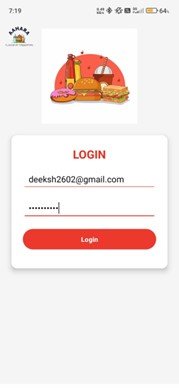
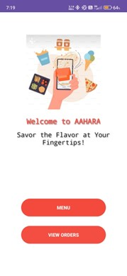
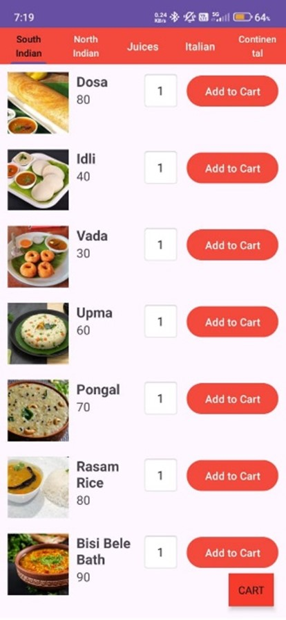
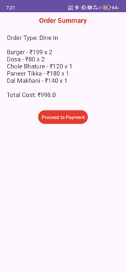
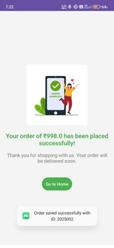
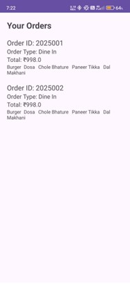

# Aahara - Food Ordering App

An Android application that enables users to order food for both dine-in and online delivery. The app leverages Firebase as its backend to manage user authentication, menu listings, and order processing efficiently.

## 📌 Features

- 🔐 User Authentication: Secure login and registration system using Firebase Authentication.  
- 🍽️ Menu Browsing: Explore a variety of dishes categorized by restaurants and cuisine types.  
- 🛒 Order Management: Add food items to cart, customize orders, and place dine-in or online delivery requests.  
- 💳 Order Confirmation: Real-time order status updates and confirmations.  
- 📋 Order History: View past orders and reorder favorite meals easily.  
- ☁️ Firebase Backend: Cloud-based database for storing user data, menus, and orders securely.  

## 🛠️ Technologies Used

## 📸 Screenshots

| 🔐 Login Page | 📝 Register Page | 🏠 Home Page | 🍽️ Menu Page |
|--------------|------------------|--------------|--------------|
|  |  |  |  |

| 🛒 Cart Page | 📋 Order Summary | ✅ Order Success | 📜 Order History |
|--------------|------------------|------------------|------------------|
|  |  |  |  |

